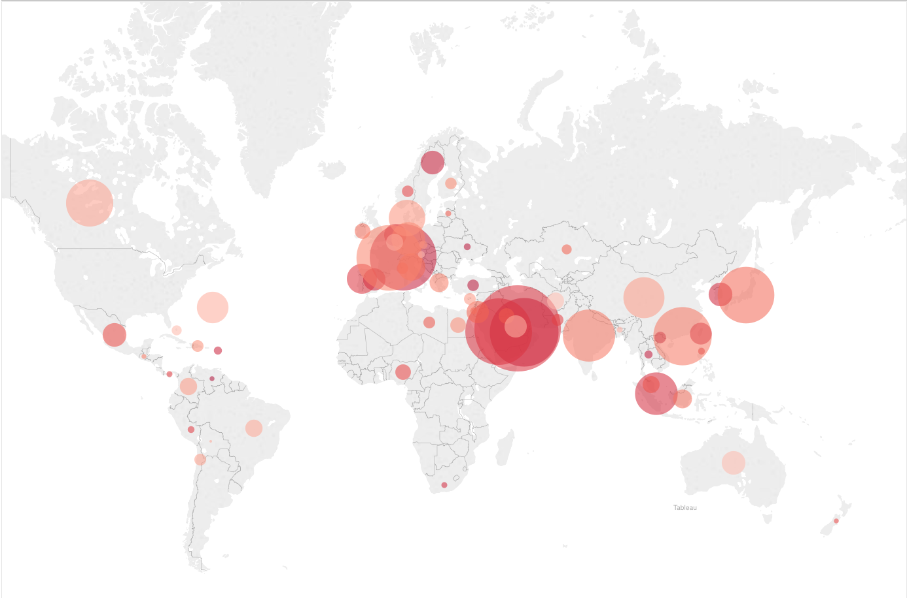

#FOREIGN GIFTS TO U.S. HIGHER EDUCATION

Increasingly, colleges enjoy hefty donations from people or entities that are based abroad.

Back in 2003, only 10 U.S. colleges reported foreign donations to the Department of Education. By 2011, the number rose to 50, according to The Chronicle of Higher Education.  In 2003 colleges received $71.2 million in gifts. In 2012, that number [grew](http://www.chronicle.com/article/Thanks-to-Outreach-US/148313) to 261.9 million. Since then, billions have flowed into American colleges from overseas.

####Where is the money going?

<iframe src="schools_chart.html" frameborder="0" marginheight="0" marginwidth="0"></iframe>

The trend seems to be that schools with strong reputations do the best. Harvard drew in a whopping $971 million in donations from entities based abroad over six years, Harvard's haul more than doubles the next highest amount a college drew in (Georgetown with $441 million).

Donations typically go to highly-reputable private-nonprofits. The share of public schools falls next in line, while donations to for-profit colleges are the most rare. 

####Donations to publics vs. privates, by school-type

<iframe src="treemap.html" frameborder="0" marginheight="0" marginwidth="0"></iframe>

India and Canada are the two big donors to for-profit colleges, which received about $114 million over six years as compared with the nearly $5 billion private non-profits receive. HCL Technologies, a software development company based in India, is in the top 20 biggest donors, and exclusively has donated to for-profit Western International University.

<iframe src="donors_chart.html" frameborder="0" marginheight="0" marginwidth="0"></iframe>

Sanofi-Aventis and AstraZeneca are two major pharmaceutical companies. The Royal Embassy of Saudi Arabia and Saudi Arabian Cultural Mission are government entities. Similarly, the Qatar National Research Fund and the Qatar Foundation are pools of money created by the Qatari government, which is flush with cash. 

Notably, donations by the Qatar Foundation exceed all other donors by far. The Qatar Foundation has a specific higher education mission: it [bankrolls](https://www.washingtonpost.com/local/education/in-qatars-education-city-us-colleges-are-building-an-academic-oasis/2015/12/06/6b538702-8e01-11e5-ae1f-af46b7df8483_story.html?utm_term=.0b5a834ea8a3) numerous U.S. campus expansions to Qatar. Called "Education City," these sprawling facilities house Georgetown and Northwestern students among others. Cornell, Carnegie Mellon and Texas A&M came to similar agreements with Qatar. 

Donations from Qatar-based entities are steadily on the rise: only foreign donations from China have seen consistent growth.

COUNTRIES OVER TIME TABLEAU

####Donations to the University of California

<iframe src="sankey2.html" frameborder="0" marginheight="0" marginwidth="0"></iframe>

UC Berkeley and the University of California system as a whole though public, is a globally recognized institution, and too receives hefty donations from abroad. That can create a tension on campuses that aims to uphold a public mission, even as their share of private funding is necessarily growing, as the state disinvests.

Students on UC Berkeley’s campus have often held the campus’s finances as a point of contention:From South Africa divestment movements to the modern day call to divest from fossil fuels, the UC takes small steps to cater to these movements. A few years ago it divested from crude oil, and then from private prisons. 

But UC Berkeley received $275 million in foreign donations from 2010 to 2016, only the seventh-largest recipient of foreign monetary donations after competitive private colleges like Harvard, MIT and Johns Hopkins. So which big corporate and government interests are looking to give money to UC Berkeley?

UC Berkeley received:
- Over $18 million from big pharmaceutical companies
- $11 million in gifts and contracts from Samsung
- Huge gifts from governments like Saudi Arabia, Israel and the UK

It's no secret that industry funding is big — in the millions. And for cash-strapped schools like UC Berkeley, that money can go far. Still industry funding, even wrapping in non-foreign research donations, makes up a small proportion of the campus's funding. 

The Daily Californian [reported](http://projects.dailycal.org/2017/private-research/) that in 2017, funding from nonprofits, the state of California and from federal research grants made up $746 million in new funding. That is about three times as much as the $275 million UC Berkeley received over the course of six years from abroad.

Data source: U.S. Department of Education. Section 117 of the Higher Education Act of 1965 mandates that colleges (that participate in Title IV assistance programs) [report](https://studentaid.ed.gov/sa/about/data-center/school/foreign-gifts) donations from foreign entities if the total of all foreign gifts have a value of $250,000 or more in a calendar year.

*This data included millions in anonymous donations which I removed when I created the top 20 colleges and top 10 donor charts.

Peter Aldhous and Dan Bauman contributed to this report.

